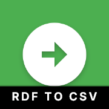
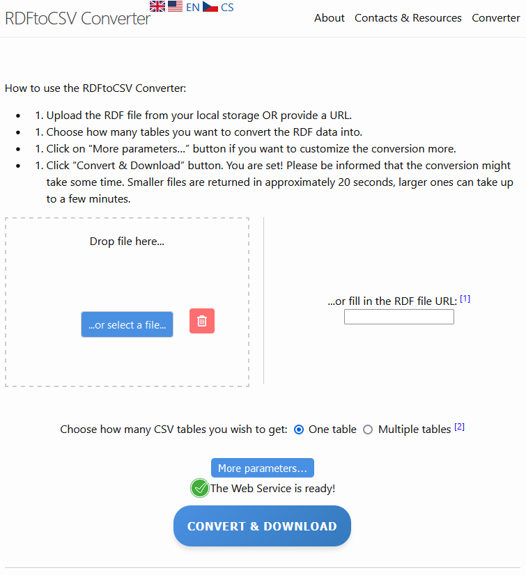
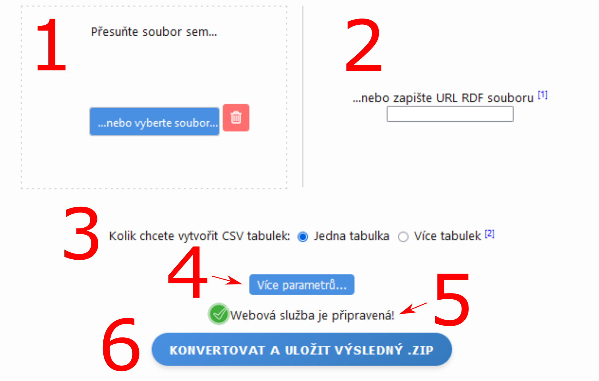
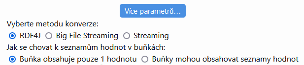
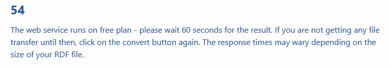
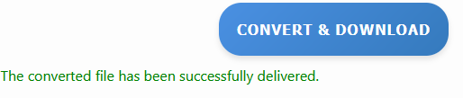
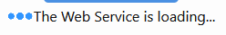

# rdf-to-csv.github.io
Github Pages for thesis about RDF to CSV converter.

<!-- Improved compatibility of back to top link: See: https://github.com/othneildrew/Best-README-Template/pull/73 -->
<a id="readme-top"></a>
<!--
*** Thanks for checking out the Best-README-Template. If you have a suggestion
*** that would make this better, please fork the repo and create a pull request
*** or simply open an issue with the tag "enhancement".
*** Don't forget to give the project a star!
*** Thanks again! Now go create something AMAZING! :D
-->


<!-- PROJECT SHIELDS -->
<!--
*** I'm using markdown "reference style" links for readability.
*** Reference links are enclosed in brackets [ ] instead of parentheses ( ).
*** See the bottom of this document for the declaration of the reference variables
*** for contributors-url, forks-url, etc. This is an optional, concise syntax you may use.
*** https://www.markdownguide.org/basic-syntax/#reference-style-links
-->

<!-- This md template has been copied from https://github.com/othneildrew/Best-README-Template -->

<!-- PROJECT LOGO -->
<br />
<div>


<h3 align="center">RDFtoCSV Converter</h3>
  <a href="https://ladymalande.github.io/rdf-to-csv.github.io/converter"  align="center">
    
  </a>
  <p align="center"> 
    RDF to CSVW data converter web service
    <br />
    <a href="https://github.com/LadyMalande/RDFtoCSV"><strong>Explore the underlying library RDFtoCSV »</strong></a>
    <br />
    <br />
    <a href="https://ladymalande.github.io/rdf-to-csv.github.io/converter">View Live Instance</a>
    ·
   </p>
</div>


<!-- TABLE OF CONTENTS -->
<details>
  <summary>Table of Contents</summary>
  <ol>
    <li>
      <a href="#about-the-project">About The Project</a>
      <ul>
        <li><a href="#built-with">Built With</a></li>
      </ul>
    </li>
    <li>
      <a href="#getting-started">Getting Started</a>
      <ul>
        <li><a href="#prerequisites">Prerequisites</a></li>
        <li><a href="#installation">Installation</a></li>
      </ul>
    </li>
    <li><a href="#usage">Usage</a>
    </li>
    <li><a href="#contact">Contact</a></li>
  </ol>
</details>


<!-- ABOUT THE PROJECT -->
## About The Project
<div id=“about-the-project”></div>
RDFtoCSV Converter is a web application built on the RDFtoCSV library and RDFtoCSV web service. It is a part of thesis.

It allows users to convert RDF files to CSV on the Web (CSVW). 

To try out live web application, go to: [RDFtoCSV Web Application](https://ladymalande.github.io/rdf-to-csv.github.io/converter).


<p>(<a href="#readme-top">back to top</a>)</p>


### Built With
<div id=“built-with”></div>
* GitHub Pages
* GitHub Actions
* [![Next][Jekyll]][]
* [![Next][HTML]][]
* [![Next][JavaScript]][]
* [![Next][CSS]][]

<p align="right">(<a href="#readme-top">back to top</a>)</p>


<!-- GETTING STARTED -->
## Getting Started
The web application has been developped for GithubPages with the help of Jekyll framework.
To continue its development, learn more about the structures from the [Jekyll](https://jekyllrb.com/) site .

### Prerequisites

Have these installed:
* Docker (Linux)
* Docker Desktop (Windows)
* Git

### Installation
Local installation of the frontend

1. Have either Docker or Docker Desktop ready
2. Clone the repository and navigate inside the project directory.
3. Build the project with 
   ```sh
   docker-compose up –build
   ```
   The first build can take up to several minutes.
4. Once the build is ready, you can open the web application at http://localhost:4000.
5. Once you want to close the web application running in the background, use:
   ```sh
   docker-compose down
   ```
<p align="right">(<a href="#readme-top">back to top</a>)</p>

<!-- USAGE EXAMPLES -->
## Usage

  <a href="https://ladymalande.github.io/rdf-to-csv.github.io/converter">
    
  </a>

Compatible RDF formats: 
• .jsonld (JSON-LD)
• .nq (N-Quads)
• .nt (N-Triples)
• .rdf (RDF/XML)
• .trig (TriG)
• .ttl (Turtle)

  <a href="https://ladymalande.github.io/rdf-to-csv.github.io/converter">
    
  </a>

Open the web application either after building it locally as instructed in Installation, or navigate to: [RDFtoCSV Web Application](https://ladymalande.github.io/rdf-to-csv.github.io/converter) - Live Web page powered by GitHub Pages.

1. Choose an RDF file or RDF URL. (Number 1 points to place where you can select a file to load, number 2 points to the text input where you can write the RDF URL)
2. Choose how many tables you would like to convert your data into. (Number 3) If the data is not suitable to be converted into multiple tables, you will get only one table from the conversion.
3. You can choose more parameters for the conversion if you click on the "More parameters..." button. (Number 4) 
   1. If you choose Streaming or BigFileStreaming, you need to provide RDF file in N-Triples format (.nt). The conversion will take much longer than the default method for conversion (RDF4J). Choosing either of those is considered for experimental purposes only.
    <a href="https://ladymalande.github.io/rdf-to-csv.github.io/converter">
    
    </a>
4. If the icon is green (Number 4), you can start the conversion by clicking on the "CONVERT & DOWNLOAD" button (Number 5)
5. Wait for the converted file to be sent back. If there is an error during the conversion, try uploading a different file or retry later.
   <a href="https://ladymalande.github.io/rdf-to-csv.github.io/converter">
    
    </a>
6. The browser should download the data automatically or you should be prompted to choose a location where to store the file.
   <a href="https://ladymalande.github.io/rdf-to-csv.github.io/converter">
    
    </a>


Smaller RDF files (<10 MB) should take up to 1 minute to be converted if the conversion method is set to "RDF4J". 

This is an example of web service not being ready to serve your request:
   <a href="https://ladymalande.github.io/rdf-to-csv.github.io/converter">
    
    </a>
<!-- CONTACT -->
## Contact

Tereza Miklóšová


Link to a repository of underlying web service that is being called in this frontend: [https://github.com/LadyMalande/RDFtoCSVWAPI](https://github.com/LadyMalande/RDFtoCSVWAPI)

Project Link for RDFtoCSV library depended on in this project: [https://github.com/LadyMalande/RDFtoCSV](https://github.com/LadyMalande/RDFtoCSV)

<p align="right">(<a href="#readme-top">back to top</a>)</p>


<!-- MARKDOWN LINKS & IMAGES -->
<!-- https://www.markdownguide.org/basic-syntax/#reference-style-links -->
[linkedin-shield]: https://img.shields.io/badge/-LinkedIn-black.svg?style=for-the-badge&logo=linkedin&colorB=555
[linkedin-url]: https://www.linkedin.com/in/tereza-miklosova/
[JavaScript]: https://img.shields.io/badge/JavaScript-F7DF1E?logo=javascript&logoColor=000
[HTML]: https://img.shields.io/badge/HTML-%23E34F26.svg?logo=html5&logoColor=white
[CSS]: https://img.shields.io/badge/CSS-1572B6?logo=css3&logoColor=fff
[Jekyll]: https://img.shields.io/badge/Jekyll-C00?logo=jekyll&logoColor=fff

This md template has been copied from [https://github.com/othneildrew/Best-README-Template]
